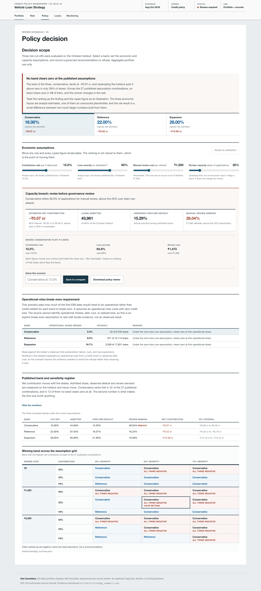
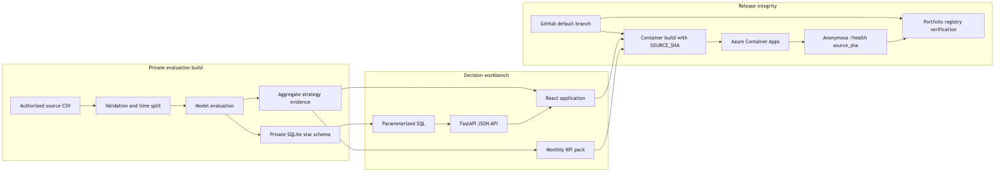

# Automobile Loan Default Strategy Portfolio

A retrospective credit-policy workbench over 233,154 Indian vehicle loans from August through October 2018. It lets a policy analyst compare evaluated risk bands, pressure-test assumption-led economics and review capacity, inspect individual loans, and decide whether any scenario is ready for governance review.

The deployed product is backed by the complete authorized dataset, not an aggregate extract. It publishes every analytical view and bounded, pseudonymous record inspection through the application. Raw source files, the derived database, direct identifiers, precise location, identity-document fields, and private delivery records are not redistributed through GitHub.

This dataset measures first-EMI default, not fraud. The product does not make approval, decline, pricing, underwriting, or adverse-action decisions.

[Live workbench](https://ca-automobile-loan-strategy.mangosand-c2cfc0f3.eastus.azurecontainerapps.io) | [Case study](CASE-STUDY.md) | [Metric glossary](docs/metric-glossary.md)



## What it does

The application has five decision-focused views:

| View | Question answered |
| --- | --- |
| Portfolio | What is in the book, and how did each vintage perform? |
| Risk analytics | Does the score separate risk, where is risk concentrated, and who is declined? |
| Policy workbench | Which evaluated cut-off survives the economic and review-capacity assumptions? |
| Loan inspector | Which individual records sit behind the aggregates? |
| Monitoring | Has the book moved, and does predicted risk match observed risk? |

At the published assumptions, no evaluated band clears zero. The conservative band is best at -₹0.07 cr, but its 95% interval crosses zero. The workbench therefore presents a refusal and the operational threshold that would change it, not a manufactured recommendation.

## Architecture

One FastAPI process serves the React application, parameterized JSON endpoints, report artifacts, and a private SQLite star schema. Hand-authored SVG charts keep the browser bundle small. The production container scales to zero on Azure Container Apps.



The release contract is explicit: the container receives the exact Git commit through `SOURCE_SHA`, `/health` reports it as `source_sha`, and the portfolio registry admits the release only when that value equals the GitHub default-branch commit.

## Evaluation

August trains, September calibrates, and October is the 98,364-loan holdout. The calibrated challenger reaches AUROC 0.64363 against 0.62286 for the logistic baseline, with Brier score 0.17364 and decile calibration error 0.04542. KS is 0.209, below what many institutions would deploy.

The conservative band admits 44.69% of the holdout at a 15.29% observed first-EMI default rate. It ranks first in 22 of 27 assumption combinations, while no band clears zero in 13 of 27. These are retrospective sensitivity results, not observed profit and loss.

See [artifacts/strategy_summary.json](artifacts/strategy_summary.json) for the generated aggregate evidence and [docs/metric-glossary.md](docs/metric-glossary.md) for definitions, direction, method, and limitations.

## Run locally

The dataset and built database are intentionally not tracked. Obtain the source under your own authority, place it at `data/quarantine/train.csv`, then run:

```bash
uv sync --frozen
uv run python scripts/build_db.py
npm ci --prefix web
npm run build --prefix web
uv run uvicorn app:app --port 7860
```

Open <http://127.0.0.1:7860>. Reproduce the aggregate evaluation with `uv run python scripts/run_evaluation.py`.

## Limits

- The source covers three consecutive months in 2018, with no later economic cycle.
- First-EMI default mixes credit risk with possible mandate or payment-plumbing failures that the source cannot separate.
- Loss severity, contribution rate, and review cost are analyst inputs, not lender-observed economics.
- Predicted risk is below observed risk in every holdout decile. The score ranks, but it does not price reliably.
- State and other operational identifiers are anonymized codes. No real names are inferred.
- The source has no protected attribute. The four-fifths view is impact screening, not a fair-lending conclusion.
- The source publisher records no clear dataset licence. The MIT licence covers the code only; see [NOTICE](NOTICE).

## Scaling

SQLite is appropriate for this read-only portfolio demo. A concurrent production workflow would move the shared SQL layer to PostgreSQL, add a governed feature pipeline, calibrate only from the most recent closed period, and add alerting for score drift, calibration, request failures, and release-source mismatch. None of that is claimed by this retrospective demo.

## Licence

Code and documentation are MIT licensed. The private source dataset and derived database are excluded from the repository and from that grant.
